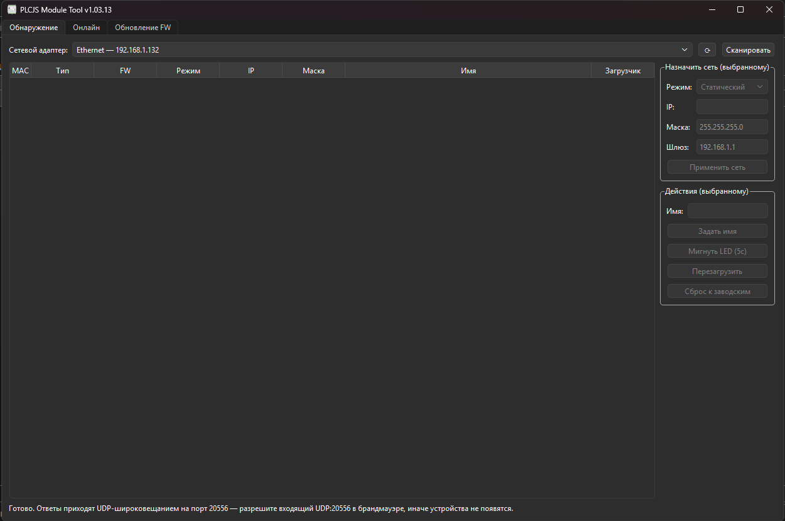
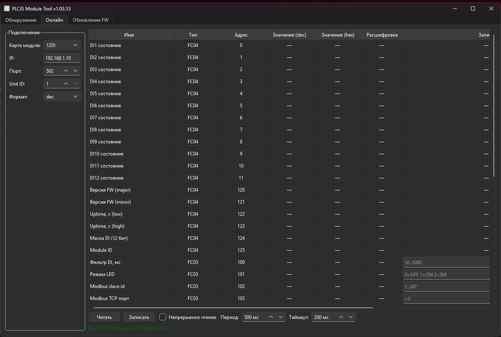
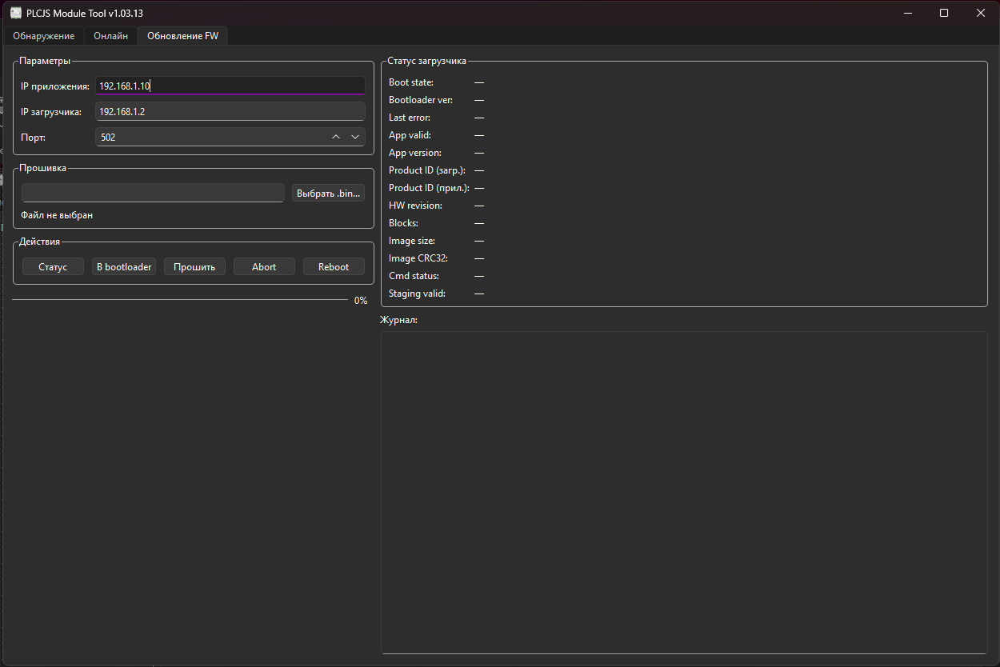

# PLCJS Module Tool

Windows-утилита на **Qt 6 Widgets / C++17** для модулей семейства **PLCJS ETH I/O**.
Программа умеет:

- находить модули по **PLCJS Discovery Protocol** (UDP broadcast, порт `20556`);
- показывать и редактировать их **Modbus TCP**-регистры через готовые карты модулей;
- переводить модуль в bootloader и выполнять **обновление прошивки** по сети.

Приложение состоит из трёх вкладок:

- **Обнаружение**
- **Онлайн**
- **Обновление FW**

Текущая версия в репозитории: **1.3.13**.

## Скриншоты

### 1. Обнаружение



### 2. Онлайн



### 3. Обновление FW



## Что умеет утилита

### Обнаружение

Вкладка **Обнаружение** рассылает пакет `IDENTIFY` через выбранный сетевой адаптер и
собирает ответы модулей по PDP.

Доступно:

- поиск устройств по **MAC**, даже если у них неправильный IP или `169.254.x.x`;
- отображение MAC, типа модуля, версии FW, режима сети, IP, маски, имени и признака bootloader;
- назначение сети выбранному устройству:
  - статический IP;
  - DHCP;
  - link-local;
- установка имени модуля;
- команды:
  - мигнуть LED;
  - перезагрузить;
  - сбросить к заводским настройкам.

Программа показывает физические адаптеры первыми, а TUN/VPN/гипервизорные адаптеры
помечает как **`[виртуальный]`**, чтобы их было сложнее выбрать по ошибке.

### Онлайн

Вкладка **Онлайн** — это браузер карты регистров Modbus TCP.

Поддерживается:

- подключение к модулю по IP/порту/Unit ID;
- выбор готовой карты модуля;
- чтение значений в формате:
  - `dec`;
  - `hex`;
- запись в writable-регистры;
- **непрерывное чтение** с настраиваемым периодом и таймаутом;
- служебные one-click-действия для стандартных регистров, где это уместно.

Поддерживаемые карты модулей:

- **12DI**
- **12DO**
- **4RTD**
- **8AIC**
- **8AOC**

Важно:

- для `4RTD` значения `float32` занимают **два регистра**, порядок слов —
  **старшее слово первым**;
- карта выбирается вручную из списка, поэтому при работе с модулем важно выбрать
  соответствующий тип.

### Обновление FW

Вкладка **Обновление FW** предназначена для OTA-обновления по Modbus TCP.

Доступно:

- чтение статуса bootloader;
- перевод приложения в bootloader;
- выбор `.bin`-файла прошивки;
- запуск прошивки с прогрессом и журналом;
- `Abort` текущего обновления;
- `Reboot` bootloader;
- отображение служебной информации:
  - состояние bootloader;
  - версия bootloader;
  - `Product ID` загрузчика и приложения;
  - `HW revision`;
  - количество блоков;
  - размер образа;
  - `CRC32`;
  - статус команды;
  - валидность staging area.

При выборе файла программа читает заголовок образа и предупреждает, если `Product ID`
образа не совпадает с `Product ID` устройства.

## Быстрый старт

### Готовый exe

В репозитории хранится готовая статическая сборка:

- `build-static/module_tool_<major>.<minor>.<patch>.exe`

Например для текущей версии это:

- `build-static/module_tool_1.3.13.exe`

Это самодостаточный `exe` для Windows, без Qt DLL рядом.

### Запуск статической сборки

```powershell
.\build-static\module_tool_1.3.13.exe
```

Сборка из исходников, developer workflow и внутреннее устройство проекта
вынесены в `AGENTS.md`.

## Сетевые требования и типовые проблемы

### 1. Discovery ничего не находит

Самая частая причина — Windows Firewall блокирует входящие broadcast-ответы PDP.
Нужно разрешить **входящий UDP-порт `20556`**.

Разово, из PowerShell с правами администратора:

```powershell
New-NetFirewallRule -DisplayName "PLCJS PDP discovery" -Direction Inbound `
    -Protocol UDP -LocalPort 20556 -Action Allow
```

Без этого вкладка **Обнаружение** может оставаться пустой даже при полностью исправном модуле.

### 2. Мешает VPN / Xray / sing-box / Clash (TUN mode)

Если VPN-клиент забирает себе default route, обычные desktop-программы часто начинают:

- не видеть broadcast discovery;
- не подключаться к локальному `192.168.x.x` / `10.x.x.x` адресу модуля;
- ошибочно ходить через туннель вместо физической Ethernet-карты.

В этой утилите уже реализована защита от такой ситуации:

- полностью отключён системный proxy для сокетов приложения;
- Modbus TCP-сокет привязывается к локальному IP из той же подсети, что и модуль;
- discovery рассылается не только на `255.255.255.255`, но и на directed broadcast
  выбранного адаптера;
- виртуальные сетевые адаптеры помечаются в списке.

Но есть предел: если VPN-клиент работает через **WFP/strict route/auto route** и
насильно перехватывает приватные сети на уровне ОС, код приложения уже не всегда может
это обойти.

В таком случае в конфигурации VPN нужно добавить правило вида:

- **private networks / LAN / geoip:private -> direct**

Иными словами: `192.168.0.0/16`, `10.0.0.0/8`, `172.16.0.0/12`, `169.254.0.0/16`
должны идти **напрямую**, а не в туннель.

## Поддерживаемое оборудование

Сейчас в приложении есть именованные карты для следующих модулей PLCJS ETH:

- **12DI**
- **12DO**
- **4RTD**
- **8AIC**
- **8AOC**

## Ограничения

- Программа рассчитана на **Windows**.
- Это не generic Modbus scanner, а специализированный инструмент под линейку
  PLCJS ETH I/O.
